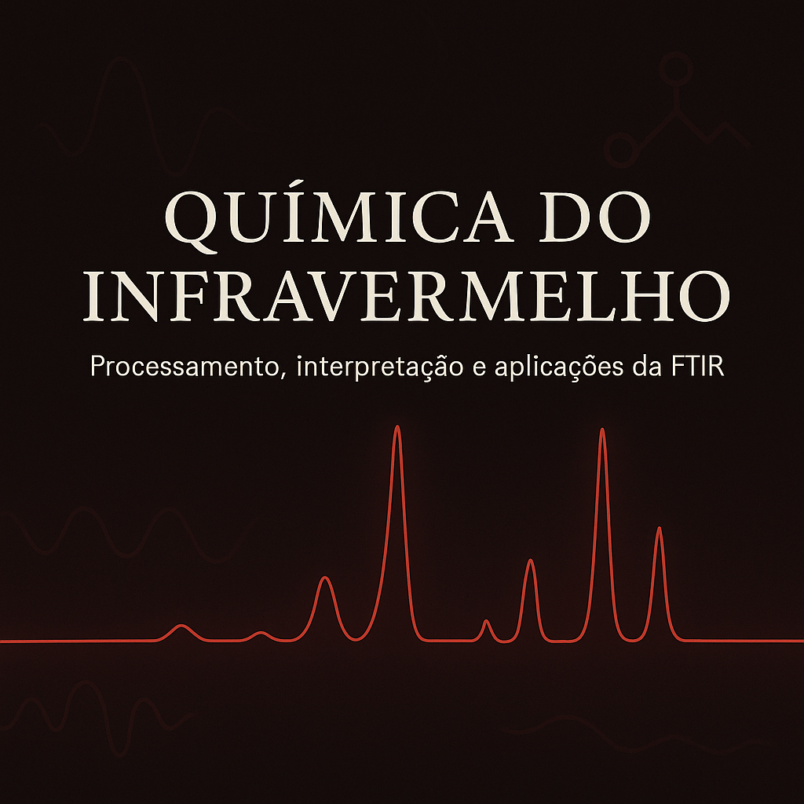

# 🎙️ Podcast – **Química do Infravermelho**
### **Subtítulo:** Processamento, interpretação e aplicações de FTIR

Este repositório reúne todos os arquivos desenvolvidos no desafio da DIO para criação de um podcast utilizando ferramentas de Inteligência Artificial. O projeto explora o uso de ChatGPT, ElevenLabs e técnicas de design para gerar um episódio completo sobre **Espectroscopia no Infravermelho (FTIR)** e suas aplicações.

---

## 🧪 **Sobre o Projeto**

Este projeto faz parte do desafio **“Crie um Podcast com IAs Generativas”** da DIO.  
O objetivo foi construir um podcast original utilizando ferramentas de IA para:

- Criar um **título atrativo** para o episódio  
- Desenvolver um **roteiro técnico, magnético e coerente**  
- Gerar uma **capa personalizada** com estética científica  
- Utilizar IA de voz (**ElevenLabs**) para produzir um áudio humanizado  
- Organizar tudo em um repositório GitHub contendo prompts, arquivos e produto final  

O tema escolhido foi:

> **Química do Infravermelho – Processamento, interpretação e aplicações de FTIR**

---

## 🎧 **Ouça o Podcast**

Clique para acessar o áudio final:

👉 [**Podcast_Final.mp3**](Podcast_Final.mp3)

---

## 📄 **Roteiro e Prompts Utilizados**

O documento inclui:

- Título criado por IA  
- Roteiro completo no formato:
  - Introdução técnica  
  - Curiosidade 1  
  - Curiosidade 2  
  - Finalização  
- Todos os prompts usados no ChatGPT  
- Estrutura narrada no episódio  

📘 **Download:**  
👉 [Prompts e Roteiro do Podcast (DOCX)](Prompts e Roteiro do Podcast.docx)

---

## 🧱 **Entendendo o Desafio**

O desafio da DIO propõe:

- Criar um podcast completo usando ferramentas de IA  
- Documentar todos os prompts utilizados  
- Editar e disponibilizar o áudio final  
- Fazer o upload de todos os arquivos no GitHub  
- Criar um README estruturado e claro  

Este repositório cumpre todos os requisitos, reunindo:

✔ Áudio final  
✔ Capa  
✔ Documentos com prompts e roteiro  
✔ Estrutura organizada  
✔ README profissional  

---

## 👩‍💻 Autoria
Desenvolvido por: **Raiane Sá**

🌐 [LinkedIn](https://www.linkedin.com/in/raiane-s%C3%A1-165b6b193/)

---
